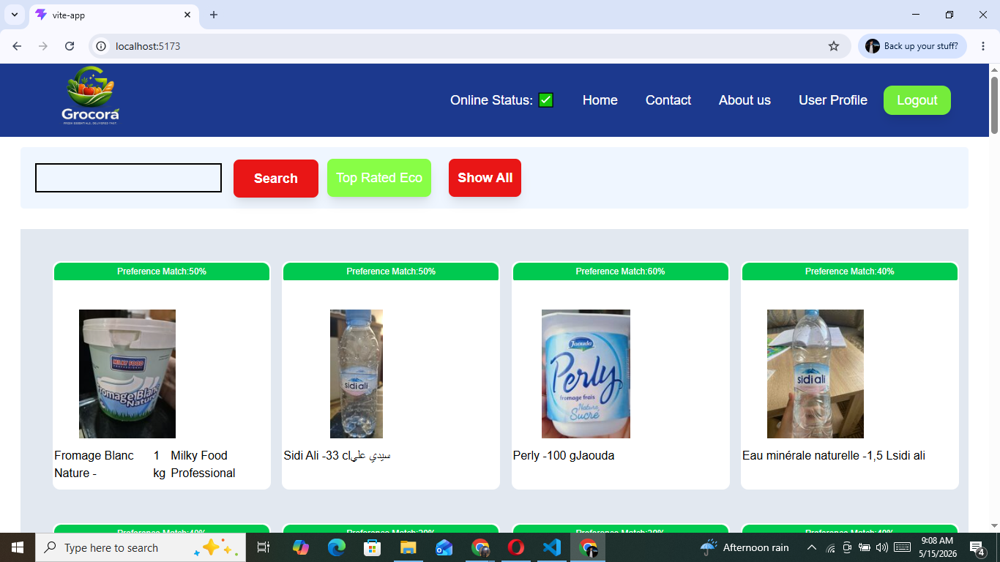
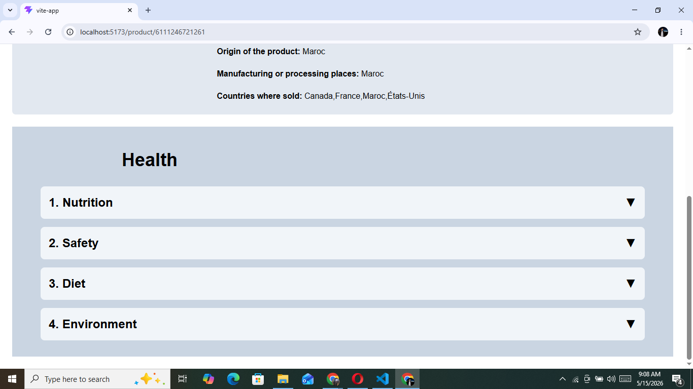
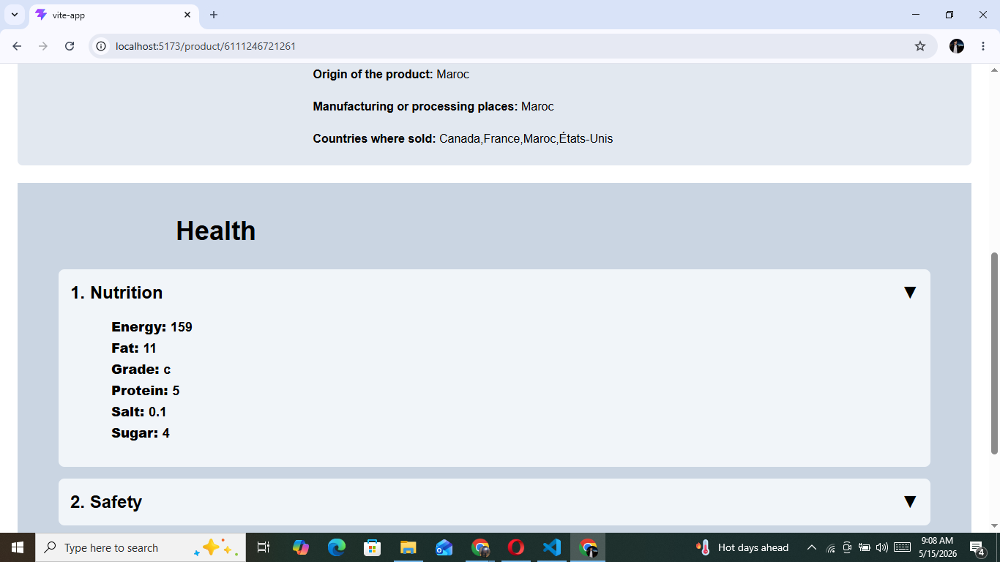
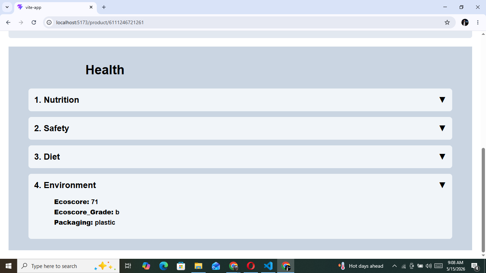

# 🥗 Grocery App — React Learning Notes

This document tracks concepts implemented while building features inside my Grocery App project. Every concept was learned through building actual features instead of isolated examples.

---

# 🚀 Features Implemented

- Higher Order Components (HOC)
- Preference Match scoring system
- Health data mapping layer
- Accordion functionality
- Controlled vs Uncontrolled components
- Lifting State Up
- API data transformation
- Defensive rendering

---

# 📸 Project Preview

## Preference Match Label

Shows a calculated percentage score based on nutrition and environmental factors.



---

## Health Section

Health card displaying grouped product information.



---

## Nutrition Section

Displays nutritional details including sugar, fat, protein, salt and grade.



---

## Environment Section

Displays eco score and packaging information.



---

# 1️⃣ Higher Order Components (HOC)

## Overview

A Higher Order Component is:

> A function that takes a component and returns an enhanced component.

Instead of modifying the original component, it wraps the component and adds extra functionality.

### General syntax

```jsx
const EnhancedComponent =
HigherOrderComponent(Component)
```

For learning this concept practically, I implemented a **Preference Match label system** for product cards. The goal was to calculate a health score for products and show a match percentage above each card.

Products receive scores according to health and environmental rules:

| Rule | Score |
|--------|--------|
| NutriScore A | +30 |
| Low Sugar | +20 |
| High Protein | +20 |
| EcoScore A/B | +20 |
| Few Additives | +10 |

Maximum score:

```txt
100
```

---

## Step 1: Create score calculation logic

The first step was creating a helper function that calculates scores from product data.

While building this logic I added defensive checks because API data may be incomplete.

Safety measures:

✔ optional chaining

✔ null checks

✔ early returns

```jsx
const calculateScores=(groData)=>{

if(!groData){
return 0
}

let score=0

const{
ecoscore_grade,
nutriscore_grade,
nutriments,
ingredients_analysis_tags
}=groData

const sugarValue=
nutriments?.sugars_100g

const proteinValue=
nutriments?.proteins_100g


if(
ecoscore_grade==="a"
||
ecoscore_grade==="b"
){
score+=20
}


if(
nutriscore_grade==="a"
){
score+=30
}

if(
sugarValue!=null
&&
sugarValue<=5
){
score+=20
}

if(
proteinValue!=null
&&
proteinValue>=10
){
score+=20
}

if(
ingredients_analysis_tags?.includes(
"en:palm-oil-free"
)
){
score+=10
}

return score

}
```

---

## Step 2: Create Higher Order Component

The HOC calculates:

- total score
- percentage
- injects additional props

```jsx
export const withPreferenceLabel=(Product)=>{

return ({groData})=>{

const totalScores=
calculateScores(groData)

const percentage=
(totalScores/100)*100

return(

<Product
groData={groData}
score={totalScores}
preference={percentage}
/>

)

}

}
```

Instead of modifying the Product component, the HOC enhances it.

This keeps components reusable and follows the idea of pure functions.

---

## Step 3: Create enhanced component

```jsx
const EnhancedProduct=
withPreferenceLabel(Product)
```

EnhancedProduct is still a React component, but it is stored inside a variable.

---

## Step 4: Render component

```jsx
<EnhancedProduct
key={product.code}
groData={product}
/>
```

---

## Step 5: Display result

```jsx
<div className="text-xs
text-center
w-full
bg-green-500
text-white">

Preference Match:
{preference}%

</div>
```

This label appears above the product card.

---

## Concepts Learned

### Pure Functions

A Higher Order Component should not rewrite or modify the original component.

Correct:

✔ enhance component

✔ inject props

✔ add features

Wrong:

❌ rewrite component behavior

---

# 2️⃣ Health Section + Accordion

The next feature implemented was a Health section inside ProductInfo.

Objective:

Display:

- Nutrition
- Safety
- Diet
- Environment

---

## Problem

API responses contained large amounts of raw data.

Directly using API responses inside JSX would create:

- repeated logic
- hard-to-maintain code
- tightly coupled UI

Solution:

Create a mapper layer.

---

## Data Mapper Pattern

Rule:

```txt
Mapper = JavaScript logic only

No React

No JSX
```

Main function:

```jsx
const mapHealthData=(product)=>{

return{

nutrition:
getNutrition(product),

safety:
getSafety(product),

diet:
getDiet(product),

environment:
getEnvironment(product)

}

}
```

The mapper converts raw API data into UI-friendly data.

Benefits:

✔ reusable

✔ cleaner

✔ maintainable

---

## Nutrition

Extracted:

- sugar
- fat
- salt
- protein
- energy
- grade

```jsx
const getNutrition=(product)=>{

return{

sugar:
product.nutriments.sugars_value,

fat:
product.nutriments.fat_value,

salt:
product.nutriments.salt_value,

protein:
product.nutriments.proteins_value,

energy:
product.nutriments["energy-kcal_value"],

grade:
product.nutriscore_grade

}

}
```

---

## Safety

Added fallback values:

```jsx
product.allergens_tags || []
```

Removed unnecessary prefixes:

```jsx
replace("en:","")
```

---

## Accordion Implementation

Goal:

Hide and display section data dynamically.

State:

```jsx
const[
openSection,
setOpenSection
]=useState(null)
```

Handler:

```jsx
const handleClick=(section)=>{

setOpenSection(

openSection===section

? null

: section

)

}
```

Logic:

If section already open:

close it

otherwise:

open it

---

Conditional rendering:

```jsx
{
openSection==="nutrition"

?

<div>

section body

</div>

:null
}
```

Header remains visible.

Body displays only when conditions match.

---

# Controlled vs Uncontrolled

Controlled:

Parent owns state

```txt
Parent

├── Nutrition

├── Safety

├── Diet
```

Children only notify:

"I was clicked"

Parent decides behavior.

---

Uncontrolled:

```txt
Nutrition controls itself

Safety controls itself
```

Memory trick:

```txt
Parent decides

= Controlled

Component decides

= Uncontrolled
```

---

# Lifting State Up

Moved state from:

```txt
HealthCard
```

to:

```txt
ProductInfo
```

Reason:

Multiple components can share and control the same state.

Benefits:

✔ single source of truth

✔ predictable UI

✔ shared control

---

# Challenges Faced

- deeply nested API fields
- missing values
- repeated JSX
- undefined crashes
- state organization

---

# Improvements Applied

✔ optional chaining

✔ fallback values

✔ mapper functions

✔ controlled architecture

✔ lifted state

---

# Next Improvement

Current accordion sections are hardcoded.

Next goal:

Generate sections dynamically using:

```jsx
map()
```

to move toward production-level implementation.